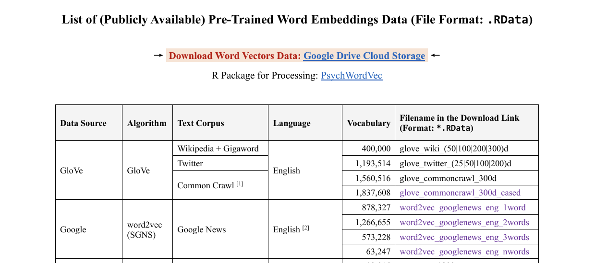

```{=html}
<style type="text/css">
  body { font-family: "Source Sans Pro", "Arial", sans-serif;
         font-size: 14px; color: #000; }
  code { font-family: "Consolas", monospace; }
  pre code span.do { font-style: normal; font-weight: bold; }
  pre code span.co { font-style: normal; color: #999; }
  pre code span.fu { color: #8959a8; }
  #header { text-align: center; }
  h1, h2, h3 { font-weight: bold; }
  h1.title { font-size: 34px; }
  h1 { font-size: 32px; }
  h2 { font-size: 28px; }
  h3 { font-size: 24px; }
  h4 { font-size: 20px; }
  #TOC li { font-size: 18px; line-height: 1.25; }
  p, li, button span { font-size: 16px; }
  .table { table-layout: fixed; width: auto; margin: 1em auto; }
  .table { border-top: 1px solid #111; border-bottom: 1px solid #111; }
  .table thead { background-color: #f0f0f0; }
  .table tr.even { background-color: #f5f5f5; }
  .table thead tr th { border-bottom-width: 0px; line-height: 1.2; }
  .table tbody tr td { border-top-width: 0px; line-height: 1.2; }
</style>
```
```{r Config, include=FALSE}
options(
  knitr.kable.NA = "",
  digits = 4
)
knitr::opts_chunk$set(
  comment = "",
  fig.align = "center", 
  fig.width = 6,
  fig.height = 4,
  dpi = 500
)
```

## 简介

<br>
本部分代码主要介绍如何使用"PsychoWord2Vec"R包实现基本的词向量线性运算以及Word Vector Association Test(WEAT)。主要分为以下部分：

1. 预训练词向量的下载及导入
2. 词向量的余弦相似度计算及可视化
3. WEAT代码及示例

<br>
**Reference：**
<br>
Bao, H.-W.-S. (2022). PsychWordVec: Word embedding research framework for     psychological science. https://CRAN.R-project.org/package=PsychWordVec
<br>
<br>

## 1. 预训练词向量的下载及导入

<br>
<br>
包寒吴霜老师为大家提供了常用的预训练静态词向量的.RData版本。<br>
下载地址：https://psychbruce.github.io/WordVector_RData.pdf
<br>

```{r echo=FALSE, out.width='80%'}

```
<br>
安装并加载必要的R包
<br>
```{r echo=TRUE}
#Pacman
if (!requireNamespace('pacman', quietly = TRUE)) {
    install.packages('pacman')
}

#Core
pacman::p_load(PsychWordVec)

#General
pacman::p_load(bruceR,tidyverse)

#Specific
pacman::p_load(irr,nlme,knitr,ggrepel,zoo,see,cowplot,sjPlot)
```
<br>
导入Rdata文件
<br>
```{r echo = TRUE, warning = FALSE}
Data_W2V = load_embed("../Data/Word2Vec/word2vec_googlenews_eng_1word.Rdata")
Data_W2V[1:10,1:10]
```
<br>
<br>

## 2. 余弦相似度计算及可视化

<br>
提取用于研究的特定词向量
<br>
```{r echo = TRUE, warning = FALSE}
#提取子集
rn <- c("positive","negative","psychology","engineering")
Data_W2V_sub <- Data_W2V[rn,]
remove(rn)

#画图
plot_wordvec(Data_W2V_sub)
```
<br>
余弦相似度的计算
<br>
```{r echo = TRUE, warning = FALSE}
Data_W2V_sub <-  normalize(Data_W2V_sub)
cos_sim(Data_W2V_sub["positive",],Data_W2V_sub["negative",])
```
<br>
也可以画相关图或网络分析图
<br>
```{r echo = TRUE, warning = FALSE}
plot_similarity(Data_W2V_sub)
plot_network(Data_W2V_sub)
plot_wordvec_tSNE(Data_W2V_sub)
```
<br>
<br>

## 3. WEAT代码及示例

<br>
数据预处理
<br>
```{r echo = TRUE, warning = FALSE}
##导入GloVe词向量（3-5min）
Data_Glo <- load_embed("../Data/Glove/glove_commoncrawl_300d_cased.Rdata", normalize = TRUE)

##数据预处理
words <- import("../Data/WEAT_words/words.csv")

process_column <- function(column, data_glo){
  column <- tolower(column)
  column <- column[column %in% rownames(data_glo) & column != ""]
  return(column)
}

subjects <- process_column(words$Subjects, Data_Glo)
A1_inter <- process_column(words$A1_inter, Data_Glo)
A2_bor <- process_column(words$A2_bor, Data_Glo)
A3_useful <- process_column(words$A3_useful, Data_Glo)
A4_useless <- process_column(words$A4_useless, Data_Glo)

Data_Glo_sub <- rbind(Data_Glo[subjects,],
                      Data_Glo[A1_inter,],
                      Data_Glo[A2_bor,],
                      Data_Glo[A3_useful,],
                      Data_Glo[A4_useless,]
                      )
```
<br>
WEAT运算代码
<br>
```{r echo = TRUE, warning = FALSE}
weat_Int = test_WEAT(Data_Glo_sub,
                     labels = list(T1 = "subjects", 
                                   A1 = "interesting", 
                                   A2 = "boring"),
                     T1 = subjects,
                     A1 = A1_inter,
                     A2 = A2_bor,
                     seed = 123)

weat_Use = test_WEAT(Data_Glo_sub,
                     labels = list(T1 = "subjects", 
                                   A1 = "useful", 
                                   A2 = "useless"),
                     T1 = subjects,
                     A1 = A3_useful,
                     A2 = A4_useless,
                     seed = 123)

weat_Int
weat_Use
```
<br>
可以对原始数据进行处理并绘图
<br>
```{r}
##数据处理
Intdiff <- weat_Int[["data.diff"]] %>%
  as.data.frame() %>%
  transmute(cosdiffInt = cos_sim_diff, T_Word = T_word)

Usediff <- weat_Use[["data.diff"]] %>%
  as.data.frame() %>%
  transmute(cosdiffUse = cos_sim_diff, T_Word = T_word)

result <- mutate(Intdiff, Usediff)

remove(Intdiff,Usediff)

result$cosdiffInt <- scale(result$cosdiffInt, center = TRUE, scale = TRUE)
result$cosdiffUse <- scale(result$cosdiffUse, center = TRUE, scale = TRUE)

cor1 <- cor.test(result$cosdiffIn,result$cosdiffUs, method = "pearson")
cor1

ggplot(result, aes(x=cosdiffUse, y=cosdiffInt)) +
  geom_point(fill = "darkolivegreen1", color = "darkolivegreen1", size=4,                   shape=21, alpha=0.8, show.legend=FALSE) +
  geom_smooth(method="lm", color="grey50") +
  geom_text_repel(aes(label=T_Word), size=2.8, seed=1, max.overlaps=20) +
  annotate("text", x=-1.5, y=2.0, size=4.5, parse=TRUE,
           label="paste(italic(r), ' = .30, 95% CI [-.22, .63]')")  +
  scale_x_continuous(limits=c(-2.5, 2.3), breaks=seq(-2.5, 2.3, 1)) +
  scale_y_continuous(limits=c(-1.5, 2.2), breaks=seq(-1.5, 2.2, 1)) +
  scale_fill_social_c(reverse=TRUE) +
  labs(x="Usefulness of specific subject",
       y="Interest of specific subject",
       title="Use-Interest Subject Association(WEAT)") +
  theme_bruce()
```
<br>
<br>

## 4. 注意事项

<br>
1. 在选择属性词时，可以利用GPT进行**同义词**拓展，增强结果的稳定性<br>
2. 在进行词向量的线性运算前，注意将词向量**归一化**(normalize)<br>
3. cos similarity的**绝对**正负值是没有意义的，因为可能存在**系统性偏差**。需要在不同结果间进行比较以获得**相对**的余弦相似度<br>
4. 通过cos similarity得到的是连续变量，理论上可以用于任何统计分析。

<br>
本部分代码主要基于包寒吴霜老师开发的R包"PsychoWordVec"，使用时请引用：<br>
Bao, H.-W.-S. (2022). PsychWordVec: Word embedding research framework for     psychological science. https://CRAN.R-project.org/package=PsychWordVec
<br>
<br>
使用WEAT范式时请引用：<br>
Caliskan, A., Bryson, J. J., & Narayanan, A. (2017). Semantics derived automatically from language corpora contain human-like biases. *Science*, *356*, 183--186. https://www.science.org/doi/10.1126/science.aal4230