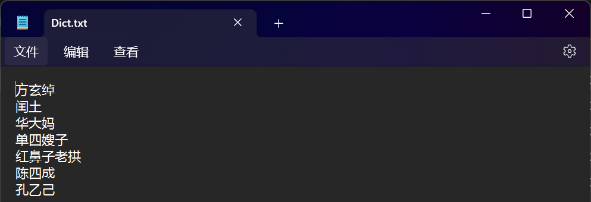

```{=html}
<style type="text/css">
  body { font-family: "Source Sans Pro", "Arial", sans-serif;
         font-size: 14px; color: #000; }
  code { font-family: "Consolas", monospace; }
  pre code span.do { font-style: normal; font-weight: bold; }
  pre code span.co { font-style: normal; color: #999; }
  pre code span.fu { color: #8959a8; }
  #header { text-align: center; }
  h1, h2, h3 { font-weight: bold; }
  h1.title { font-size: 34px; }
  h1 { font-size: 32px; }
  h2 { font-size: 28px; }
  h3 { font-size: 24px; }
  h4 { font-size: 20px; }
  #TOC li { font-size: 18px; line-height: 1.25; }
  p, li, button span { font-size: 16px; }
  .table { table-layout: fixed; width: auto; margin: 1em auto; }
  .table { border-top: 1px solid #111; border-bottom: 1px solid #111; }
  .table thead { background-color: #f0f0f0; }
  .table tr.even { background-color: #f5f5f5; }
  .table thead tr th { border-bottom-width: 0px; line-height: 1.2; }
  .table tbody tr td { border-top-width: 0px; line-height: 1.2; }
</style>
```
```{r Config, include=FALSE}
options(
  knitr.kable.NA = "",
  digits = 4
)
knitr::opts_chunk$set(
  comment = "",
  fig.align = "center", 
  fig.width = 6,
  fig.height = 4,
  dpi = 500
)
```

## 简介

<br>
之前给大家介绍的都是使用**预训练**好的大规模语料库进行研究。<br>
<br>
但是，当我们想要研究特定群体、特定时间、特定主题的语料库时，应该如何操作？<br>
<br>
本部分代码主要展示如何使用已经获取的语料实现**自训练**词向量。<br>
<br>
下一部分将讨论如何使用爬虫技术获取特定的大规模语料库。<br>
<br>
本部分代码主要分为以下部分：

1. 中文分词的基本原理
2. 运用Python-Jieba实现中文分词
3. 利用分词结果实现词向量训练

<br>
**Reference:**
<br>
Bao, H.-W.-S. (2022). PsychWordVec: Word embedding research framework for     psychological science. https://CRAN.R-project.org/package=PsychWordVec
<br>
<br>

## 1. 中文分词的基本原理

<br>
（作者本人也基本没有懂，所以本部分听听就好）
<br>
<br>
假设我们有这样一句话，如何让机器进行分词？
```{r echo=FALSE, out.width='50%', fig.align='left'}

```
<br>
**第一种方法：机械分词（查词典）**<br>
<br>
预先设定一个词典，然后通过从左到右扫描的方式，匹配词典中的词。<br>
<br>
好做，但精度很低。
<br>
<br>
**第二种方法：统计分词（马尔可夫假设）**<br>
<br>
统计分词的基本原理是计算不同分词结果的最大概率情况，即最优分词结果。
```{r echo=FALSE, out.width='50%'}
knitr::include_graphics(c("../Pictures/6.png","../Pictures/7.png"))
```
<br>
统计分词在实际应用中表现优异，可以胜任大部分分词任务，是目前最常用的方法之一。<br>
<br>
深入原理可以参考：https://zhuanlan.zhihu.com/p/146792308<br>
<br>

## 2. Jieba分词应用

<br>
**第一步**：在Python环境（或Conda环境）中安装Jieba工具包。<br>
"win+r"输入cmd，输入以下语句：
```{bash eval=FALSE}
pip install jieba
```
<br>
**第二步**：使用Visual Studio Code（或其它类似软件如Spider）打开以下路径文件：<br>
<br>
".../NLP4Psy/Jieba.py"<br>
<br>
```{r echo=FALSE, out.width='80%'}

```
<br>
上面这部分代码大家不需要看懂任何句子，只需要找到以下五行：
```{python eval=FALSE}
input_file_path = "./Data/Jieba/Nahan.txt" #需要分词的文件路径
output_file_path = "./Data/Jieba/JiebaResult.txt" #希望输出的文件路径
dict_files_path = "./Data/Jieba/Dict.txt" #指定让jieba默认分词的词语（如不需要可不填）
stopwords_file_path = "./Data/Jieba/Stopwords.txt" #停用词文件路径（如不需要可不填）
segment_text(input_file_path, output_file_path, stopwords_file_path, dict_files_path)
```

<br>
在**"input_file_path ="**中，输入你需要进行分词的.txt文件路径名
```{r echo=FALSE, out.width='60%', fig.align='left'}

```

<br>
在**"output_file_path"**中，输入你输出分词结果的.txt文件路径
```{r echo=FALSE, out.width='60%', fig.align='left'}

```

<br>
在**"dict_file_path"**中，输入你想让Jieba默认分词的词表.txt文件路径<br>
例如在进行《呐喊》分词时，设置人名都作为默认词（注意每个词为一行）
```{r echo=FALSE, out.width='60%', fig.align='left'}

```

<br>
在**"stopwords_file_path"**中，输入停用词，即将特定对自然语言处理用处不大的词忽略<br>
为大家提供了哈工大的中文停用词表，是目前使用较为广泛的一种。
```{r echo=FALSE, out.width='60%', fig.align='left'}

```

<br>
运行代码后即可获得分词完毕的结果。网上有大量Jieba的教程，如有特殊需求大家可以自行学习并更改代码，通过github上传到仓库中进行共享。
<br>
<br>

## 3. 训练词向量

<br>
包寒吴霜老师开发的**"PsychoWordVec"**R包中有自训练词向量的函数**"train_wordvec()"**<br>
使用时请查询帮助文档：https://psychbruce.github.io/PsychWordVec/reference/train_wordvec.html<br>
在使用**train_wordvec()**函数时请仔细查看参数，根据研究需要进行设置。<br>
<br>
下面对代码进行简单演示：
```{r echo=TRUE}
#导入必要的R包
if (!requireNamespace('pacman', quietly = TRUE)) {
    install.packages('pacman')
}

pacman::p_load(PsychWordVec,text2vec)

#导入完成分词的文本
text_vector <- readLines("../Data/Jieba/JiebaResult.txt")
text_vector[1:3]
```
```{r echo=TRUE}
WordVec = train_wordvec(text_vector,
                        method = "word2vec", #预训练的算法
                        dims = 300, #词向量的维度
                        window = 5, 
                        min.freq = 5,
                        model = "skip-gram", #Word2Vec模型算法
                        normalize = TRUE, #是否归一化
                        tokenizer = text2vec::space_tokenizer, #按照空格分词，该方法下不要改
                        file.save = "../Data/trainedVec/Nahan.RData")

WordVec = as_embed(WordVec)
```

<br>
我们可以对训练好的词向量进行一些简单的检查，看看我们训练的词向量质量如何
```{r echo=TRUE}
most_similar(WordVec)
most_similar(WordVec, "孔乙己")
```

<br>
似乎不是很好：<br>
怎么余弦相似度都这么大？<br>
似乎训练的又很好：<br>
孔乙己相关的东西确实还行。<br>
<br>
我们要不试试更大的语料库——清华大学自然语言处理实验室：http://thuctc.thunlp.org/
```{r echo=TRUE}
#导入完成分词的文本
text_vectorTH <- readLines("../Data/Jieba/财经.txt")
text_vectorTH[1]
```
```{r echo=TRUE}
WordVecTH = train_wordvec(text_vectorTH,
                        method = "word2vec", #预训练的算法
                        dims = 300, #词向量的维度
                        window = 5, 
                        min.freq = 10,
                        model = "skip-gram", #Word2Vec模型算法
                        normalize = TRUE, #是否归一化
                        tokenizer = text2vec::space_tokenizer, #按照空格分词，该方法下不要改
                        )

WordVecTH = as_embed(WordVecTH)
```

<br>
这次再让我们来检查一下：
```{r echo=TRUE}
most_similar(WordVecTH)
most_similar(WordVecTH, "基金")
```

<br>
好像结果正常多了，于是我们拥有了自己的词向量！<br>
<br>

## 注意事项

<br>
**关于Jieba分词：**<br>
1. 本部分提供的Jieba分词是最基础的语句，对于合并处理多个.txt文件的情况，大家可以咨询GPT（亲测有用且高效）。<br>
2. Jieba分词建议以段落为单位划分，也可以采用句子或篇章为单位划分。但不建议用逗号划分，会损失很多语义信息。<br>
3. Jieba分词时词典的编制很重要，有些想要研究的词或特定名词请提前标注。<br>
4. 停用词的采用也会影响语义提取，若非必须可不采用。<br>

<br>
<br>
**关于预训练模型：**<br>
1. 语料库规模在百万级以上，多次训练得到的词向量才趋于稳定，因此需要大规模的文本获取(请见下部分爬虫教程)。<br>
2. 训练词向量的模型方法很多，可以采用多个模型进行交叉验证。<br>
3. 自训练的词向量对于研究特定主题来说具有优势，但若主题较为宽泛，使用预训练好的词向量是更稳健的选择。<br>

<br>
<br>
**本部分为初步学习Jieba分词与自训练词向量的经验分享，可能并未完全覆盖实际使用时的需求，如有错误、补充请通过github上传：https://github.com/PsyJin-re/NLP4Psy**
<br>
<br>
**Reference:**<br>
Bao, H.-W.-S. (2022). PsychWordVec: Word embedding research framework for     psychological science. https://CRAN.R-project.org/package=PsychWordVec<br>
<br>
部分Jieba代码来源：https://blog.csdn.net/qq_41897800/article/details/113802995
<br>
<br>
部分知识来源：中国科学院心理研究所 柏松石
<br>
