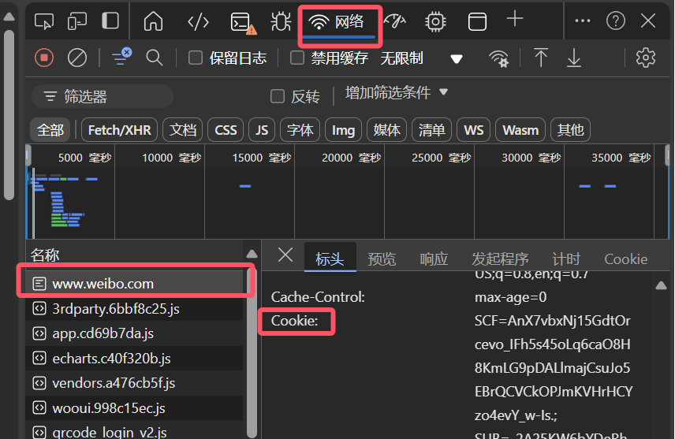
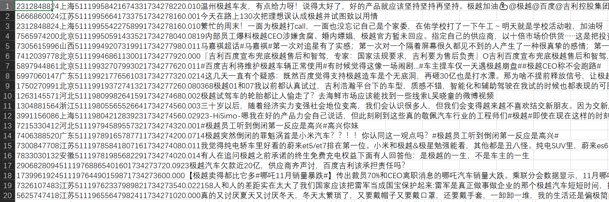
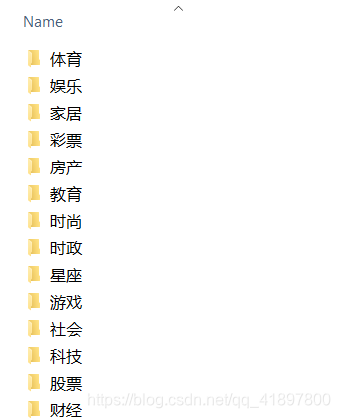
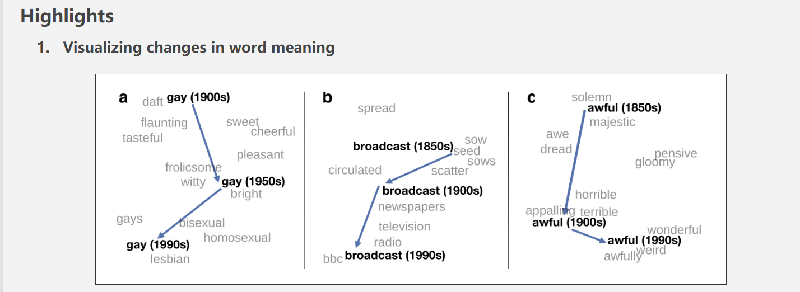

```{=html}
<style type="text/css">
  body { font-family: "Source Sans Pro", "Arial", sans-serif;
         font-size: 14px; color: #000; }
  code { font-family: "Consolas", monospace; }
  pre code span.do { font-style: normal; font-weight: bold; }
  pre code span.co { font-style: normal; color: #999; }
  pre code span.fu { color: #8959a8; }
  #header { text-align: center; }
  h1, h2, h3 { font-weight: bold; }
  h1.title { font-size: 34px; }
  h1 { font-size: 32px; }
  h2 { font-size: 28px; }
  h3 { font-size: 24px; }
  h4 { font-size: 20px; }
  #TOC li { font-size: 18px; line-height: 1.25; }
  p, li, button span { font-size: 16px; }
  .table { table-layout: fixed; width: auto; margin: 1em auto; }
  .table { border-top: 1px solid #111; border-bottom: 1px solid #111; }
  .table thead { background-color: #f0f0f0; }
  .table tr.even { background-color: #f5f5f5; }
  .table thead tr th { border-bottom-width: 0px; line-height: 1.2; }
  .table tbody tr td { border-top-width: 0px; line-height: 1.2; }
</style>
```
```{r Config, include=FALSE}
options(
  knitr.kable.NA = "",
  digits = 4
)
knitr::opts_chunk$set(
  comment = "",
  fig.align = "center", 
  fig.width = 6,
  fig.height = 4,
  dpi = 500
)
```

## 简介

<br>
在上一部分中，我们提到自训练词向量需要**百万、千万级**的语料库<br>
<br>
那么，我们如何去获取大规模的语料库用于研究呢？<br>
<br>
本部分将介绍基础的爬虫程序(基于新浪微博)以及常用的公开语料库<br>
<br>
希望能帮助大家获取**特定主题**、**特定时间**、**特定群体**的语料库，训练自己的词向量。<br>
<br>

## 1. 爬虫程序(基于新浪微博)

<br>
**叠甲 × 1**：本部分爬虫程序参考自中国科学院心理研究所计算网络心理实验室，对具体程序进行了部分修改，以满足使用需求。<br>
<br>
**叠甲 × 2**：本部分爬虫程序非常基础，能够对所提供**关键词**进行微博数据爬取，获取微博文本、IP地址、用户ID等基本信息。部分设想中的功能实际上并未实现。<br>
<br>
**叠甲 × 3**：因为作者本人对爬虫的基础知识有限，如对爬虫有进一步需求，可通过github/CSDN等网站进行查询。如有计算机大神帮助完善功能不胜感激，可通过https://github.com/PsyJin-re/NLP4Psy上传修改后的程序。<br>
<br>
叠甲完毕，让我们来看看如何使用我们的爬虫程序。<br>
<br>
**第一步**：环境配置，"win+r"打开cmd，在Python环境(或conda虚拟环境)中输入以下代码，安装Python包。
```{bash eval=FALSE}
pip install scrapy
pip install Pillow
```
<br>
**第二步**：用VS code等软件打开"./NLP4Psy/4_Spider/Spider/weibo/settings.py"，对下述参数进行设置：<br>
<br>
在"KEYWORD_LIST"后输入搜索关键词，可同时输入多个：
```{python eval=FALSE}
KEYWORD_LIST = ['极越']
```
<br>
在"START_DATE"与"END_DATE"处输入起止日期：
```{python eval=FALSE}
START_DATE = '2024-12-13'
END_DATE = '2024-12-15'
```
<br>
在"RESULT_DIR"处输入结果文件保存的**绝对路径**：
```{python eval=FALSE}
RESULT_DIR = 'F:/5_ECNU/2_Data analysis method/Natural Language processing/NLP4Psy/Data/Spider'
```
<br>
**第三步**：打开浏览器，进入www.weibo.com，登陆账号(建议是新注册或不常用的账号)。F12打开"开发者工具"，按下图找到cookie：
```{r echo=FALSE, out.width='80%', fig.align='left'}

```
<br>
将找到的cookie复制到下方代码中：
```{python eval=FALSE}
DEFAULT_REQUEST_HEADERS = {
  cookie = "[复制在这里]"
}
```
<br>
**第四步**：进入"weibo"文件夹，在空白处"shift+右键"打开终端，输入以下代码(不要忽略空格)：
```{bash eval=FALSE}
scrapy crawl search -s JOBDIR=crawls/search
```
<br>
上述操作完成后，等待一会爬虫即开始。可根据需求通过"ctrl + c"暂停爬虫(会继续运行一阵子再暂停)，下一次继续时会从上次中断的地方重新开始。
<br>
<br>
我们来看看爬虫得到的数据:
```{r echo=FALSE, out.width='80%', fig.align='left'}

```
<br>
**第五步**：打开"./NLP4Psy/4_Spider/Spider/weibo/csvtotxt.py"，修改以下两行代码并运行：
```{python eval=FALSE}
input_csv = "极越_output.csv"  # 爬虫的结果文件路径
output_txt = "极越.txt"  # 输出的txt文件路径
```
上述代码可以将爬虫输出的.csv文件输出为我们可以用作分词的.txt文件。<br>
随后利用上一部分的jieba.py进行分词。即可用于训练词向量<br>
<br>
<br>
**当前爬虫程序的待完善之处：**<br>
<br>
1. 理论上，通过在REGION函数中输入省市名，可获取特定区域的数据集，但实际操作中这部分代码并未实现该功能。作者根据GPT的建议进行过一些修改，导致整个爬虫程序无法运行。<br>
<br>
2. 当前爬虫速度在5分钟7-8万字左右，达到训练词向量所需的文本量仍需要一定时间，可以通过修改某些参数实现加速，但同时会增大被反爬机制发现的风险。<br>
<br>
其它问题欢迎使用者补充，如有完善请联系作者，再次感谢！<br>
<br>

## 2. 公开的大规模语料库

<br>
不难发现，自己爬取大规模语料库的时间与技术成本都是相对较高的。<br>
<br>
那么，有没有简单的方法：<br>
<br>
比如，找到现成的大规模语料库呢？
<br>
<br>

### (1) 特定主题的语料库

<br>
大家可以通过这个网站找到目前常用(不限于这些)的中文语料库：<br>
https://blog.csdn.net/qq_41897800/article/details/113802995<br>
<br>
重点推荐一下清华大学自然语言处理实验室的数据集：
```{r echo=FALSE, out.width='50%', fig.align='left'}

```
<br>
包含了体育、娱乐、财经等多个板块的语料库，可以按需取用。
<br>
可以通过下述Python代码实现下载后资源的整理、分词。
```{python eval=FALSE}
import os
import re
import jieba

stopwords_table_path = './Data/Jieba/Stopwords.txt'
with open(stopwords_table_path, 'r', encoding='utf-8') as file:
    stopwords_table = file.readlines()

stopwords_list = [item.strip() for item in stopwords_table]  # 创建停词表

NewsCatalog = ['财经']
file_path = 'F:/5_ECNU/2_Data analysis method/THUCNews/'

for category in NewsCatalog:
    combine = open(file_path + '{}.txt'.format(category), 'w', encoding='utf-8')
    sentence = []
    
    # 获取财经文件夹中的所有文件
    category_path = os.path.join(file_path, category)
    files = sorted(os.listdir(category_path))  # 按照文件名排序，确保按顺序处理文件
    
    for file_name in files:
        if file_name.endswith('.txt'):
            try:
                print(f"正在处理文件：{file_name}")
                with open(os.path.join(category_path, file_name), 'r', encoding='utf-8') as file:
                    txt = file.read().replace('\n　　', ' ')  # 一篇文章为一排
                    txt = ''.join(re.findall('[\u4e00-\u9fa5| |]', txt))  # 仅保留中文字符和空格
                    txt = ' '.join(jieba.cut(txt, cut_all=False)).replace('   ', ' ')  # 使用jieba分词
                    for word in txt.split(' '):
                        for stopword in stopwords_list:
                            if word == stopword:
                                txt = txt.replace(stopword + ' ', '')  # 去掉停用词
                    sentence.append(txt + '\n')
            except Exception as e:
                print(f"处理文件 {file_name} 时出现异常：{e}")
                continue

    combine.write(''.join(sentence))
    print(f"{category}文本处理完毕")

```
<br>

### (2) 特定时间的语料库

<br>
**预训练词向量方面**：<br>
斯坦福大学基于Google Books训练了跨年代的词向量(包含英语、汉语等多种语言)。<br>
网址：https://nlp.stanford.edu/projects/histwords/<br>
可以帮助我们研究语义的跨年代变化(通常以**10年**为单位)：<br>
```{r echo=FALSE, out.width='80%', fig.align='left'}

```
<br>
**自训练词向量方面**：<br>
现有的爬虫技术基本能实现以**天**为单位的信息内容爬取，<br>
允许我们进行更具有**细粒度**的自然语言处理研究。<br>
但以天为单位的语料库是否能支持训练稳定的词向量，以及是否能反映一些心理变化趋势还有待探索。<br>
<br>

### (3) 特定群体的语料库

<br>
以**地域特征**划分的群体方面(如国家、省份、城市等)：<br>
跨国家的群体可以通过跨语言的词向量差异来进行比较;<br>
跨省份、跨城市的群体，可以通过爬虫技术来实现（求求代码）<br>

<br>
以**客观特征**划分的群体方面(如性别、收入等)：<br>
理论上来说，只需要找到特定群体常用的语料库平台，就可以推测潜在的群体差异。<br>
例如，小红书之于女性，虎扑之于男性。<br>
还有一种潜在的理论方法(纯画饼)，通过机器学习初步实现依据语料中的关键词进行分类，奢侈品关键词对应高收入群体...<br>

以**隐式特征**划分的群体方面(如流动儿童、留守儿童)：<br>
目前没有能想到能够实现的方式<br>
毕竟大家不会在网上说：我就是流动儿童...<br>
<br>

## 总结

<br>
本部分介绍了针对微博的爬虫程序的初步应用方式，以及如何通过互联网资源寻找大规模的公开语料库。<br>
<br>
随着自然语言处理技术的发展，**免费、公开**的大规模语料库能够轻松的获取，基本可以满足大部分自训练词向量的需求。<br>
<br>
无论是通过预训练词向量，还是通过自训练词向量，都能为心理学的研究补充独特的视角。<br>
<br>
希望大家可以开始使用自然语言处理技术，做出更具有生态效度的研究。<br>
<br>
<br>
**本文为学习过程中的经验分享，如有错误、不足，欢迎提出并改正！不胜感激！**<br>
可以通过github网站上传改正后的内容：https://github.com/PsyJin-re/NLP4Psy